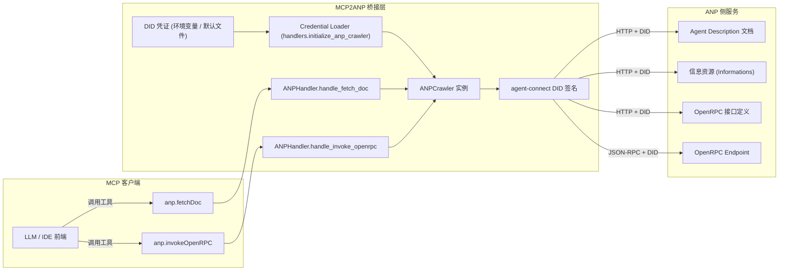

# MCP2ANP

> MCP ↔ ANP 桥接服务，让支持 MCP 的客户端像调用本地工具一样使用 ANP 智能体。

[](https://www.python.org/downloads/)
[](https://opensource.org/licenses/MIT)

## 项目简介

MCP2ANP 面向 Claude Desktop、Cursor 等 MCP 客户端，将 ANP（Agent Network Protocol）的“爬虫式”交互流程映射成 MCP 工具调用，免去客户端改造。桥接层提供两个工具：`anp.fetchDoc` 负责探索，`anp.invokeOpenRPC` 负责执行。

## 核心特性

- 两个稳定的核心工具，覆盖 ANP 资源发现与操作执行。
- DID 凭证加载与签名能力，支持本地文件或自定义路径。
- 本地 stdio 与远程 HTTP 双模式，适配桌面与服务端部署。
- 结构化日志，方便追踪调用链路与调试。
- 官方示例、单元测试与集成测试辅助验证。

## 运行模式速览

| 模式 | 传输方式 | 认证方式 | 典型场景 |
| --- | --- | --- | --- |
| 本地 stdio | stdin/stdout | 环境变量或默认 DID 文件 | 桌面客户端、单机调试 |
| 远程 HTTP | FastMCP HTTP | Header 中的 `X-API-Key` | 多租户服务端、共享实例 |

## 架构设计

桥接层由 `mcp2anp.server`（stdio）与 `mcp2anp.server_remote`（HTTP）两种入口组成，二者都会加载共享的 `ANPHandler`（定义于 `mcp2anp/core/handlers.py`）。处理流程包括以下关键阶段：



本地模式将 `server.py` 通过 stdio 暴露为 MCP 工具；远程模式则由 `server_remote.py` 基于 FastMCP HTTP 端口化，并在请求头中完成 API Key → DID 凭证映射。无论模式如何，工具调用最终都通过 `agent-connect` 客户端对接 ANP 网络。

## 先决条件

- Python 3.11+
- [uv](https://github.com/astral-sh/uv) 作为依赖管理工具
- ANP DID 文档与私钥（可先使用 `docs/did_public/` 示例）
- 远程模式需可用的 API Key 发放/校验服务

## 快速上手

1. **安装依赖**

   ```bash
   git clone git@github.com:agent-network-protocol/mcp2anp.git
   cd mcp2anp
   uv venv --python 3.11
   uv sync
   ```

2. **启动本地 stdio 模式**

   ```bash
   export ANP_DID_DOCUMENT_PATH="docs/did_public/public-did-doc.json"
   export ANP_DID_PRIVATE_KEY_PATH="docs/did_public/public-private-key.pem"
   uv run python -m mcp2anp.server --log-level INFO
   ```

   在 Claude Desktop 中添加（需在仓库根目录执行）：

   ```bash
   claude mcp add mcp2anp \
     --env ANP_DID_DOCUMENT_PATH="$PWD/docs/did_public/public-did-doc.json" \
     --env ANP_DID_PRIVATE_KEY_PATH="$PWD/docs/did_public/public-private-key.pem" \
     -- uv run python -m mcp2anp.server
   ```

3. **启动远程 HTTP 模式**

   ```bash
   uv run python -m mcp2anp.server_remote --host 0.0.0.0 --port 9880
   ```

   在客户端注册：

   ```bash
   claude mcp add --transport http mcp2anp-remote https://your-host/mcp \
     --header "X-API-Key: YOUR_API_KEY"
   ```

   校验 API Key（需 `jq`）：

   ```bash
   curl -sS -H "X-API-Key: YOUR_API_KEY" \
     "https://didhost.cc/api/v1/mcp-sk-api-keys/verify" | jq .
   ```

4. **运行官方 Demo**

   ```bash
   uv run python examples/mcp_client_demo.py
   ```

   Demo 会列出工具、加载示例凭证并演示 `anp.fetchDoc` 与 `anp.invokeOpenRPC` 的完整闭环。

### 使用 uvx 快速体验

如果尚未在系统中安装 `uv`，也可以使用随发行版提供的 `uvx` 临时运行本项目：

```bash
# 在当前仓库目录下执行，uvx 会读取 pyproject.toml 解析依赖
uvx --from . python -m mcp2anp.server --log-level INFO

# 执行单元测试（示例）
uvx --from . pytest --maxfail=1
```

`uvx` 会为每次调用创建并缓存隔离环境，适合快速体验或 CI 场景；若需重复开发，仍推荐使用上文的 `uv venv` + `uv sync` 方式。

## 工具详解

### `anp.fetchDoc`

- 输入：`url`
- 输出：资源内容（`text` 或 `json`），以及待探索的结构化 `links`
- 用法：递归遍历 ANP 网络，读取描述、接口或下一跳链接

### `anp.invokeOpenRPC`

- 输入：`endpoint`、`method`、`params`
- 输出：OpenRPC 定义的调用结果
- 用法：先用 `fetchDoc` 获取 OpenRPC 规范，再据此构造参数完成操作执行

## 常见问题

- **本地模式认证失败**：确认 DID 文档和私钥路径无误且具备读取权限。
- **远程模式返回 401**：检查 `X-API-Key` 是否正确并对应到验证服务。
- **MCP 客户端未显示工具**：确认传输方式（stdio/HTTP）与运行模式一致。
- **需更多日志**：运行时增加 `--log-level DEBUG`，或查看 `logs/` 目录。

## 更多资料

- 远程部署说明：`docs/server_remote.md`
- 协议背景及草案：`spec.md`
- 示例载荷：`docs/examples/`
- 客户端脚本与迁移说明：`examples/`

## 参与贡献

开发流程、代码规范、测试要求请参考 `CONTRIBUTING.md`。

## 许可证

MIT License
