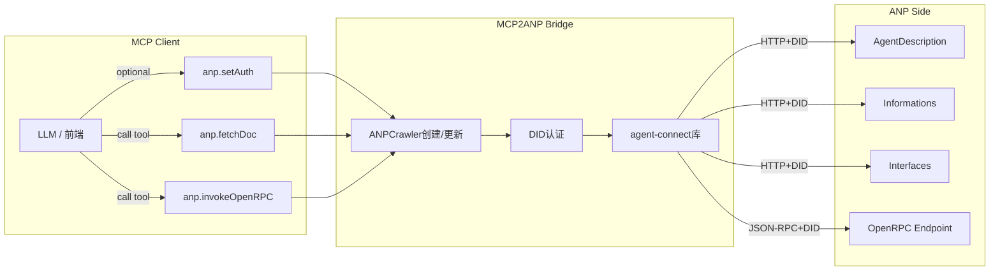

# MCP2ANP

**MCP to ANP Bridge Server** - 让任何支持 MCP 的应用，像"本地工具"一样访问 ANP 智能体

[](https://www.python.org/downloads/)
[](https://opensource.org/licenses/MIT)

## 概述

MCP2ANP 是一个 **本地 MCP 服务器**，将 ANP (Agent Network Protocol) 的"爬虫式"交互范式转换为 MCP (Model Control Protocol) 工具，使 Claude Desktop、Cursor、各类 IDE 等 MCP 客户端无需改造即可访问 ANP 智能体。

### 核心特性

- 🔧 **三个核心工具**: `anp.setAuth`、`anp.fetchDoc`、`anp.invokeOpenRPC`
- 🔐 **DID 认证支持**: 本地 DID 文档和私钥管理
- 🌐 **协议适配**: ANP 爬虫式交互 ↔ MCP 工具式交互
- 🚀 **本地服务**: 无需远程服务器，直接运行在本地
- 📊 **结构化日志**: 完整的操作追踪和调试信息
- 🧪 **全面测试**: 单元测试和集成测试覆盖

## 架构设计



## 快速开始

### 安装

```bash
# 克隆项目
git clone <repository-url>
cd mcp2anp

# 创建 Python 3.11 虚拟环境
uv venv --python 3.11

# 安装依赖
uv sync
```

### 启动服务器

```bash
# 开发模式（带热重载）
uv run mcp2anp --reload --log-level DEBUG

# 生产模式
uv run mcp2anp --log-level INFO
```

### 运行官方 Demo（推荐）

项目提供了基于 MCP 官方 SDK 的完整客户端演示脚本，能够从启动服务器到调用所有工具一次跑通。推荐使用下列命令直接体验：

```bash
uv run python examples/mcp_client_demo.py
```

> 该脚本会通过 stdio 启动 `mcp2anp.server`，依次演示 `anp.setAuth`、`anp.fetchDoc` 与 `anp.invokeOpenRPC`。如需与真实 ANP 服务联调，请确保本地或远程 JSON-RPC 端点可达。

### Claude code中添加此mcp server

```bash
cd project_root
claude mcp add mcp2anp \
  --env ANP_DID_DOCUMENT_PATH=docs/did_public/public-did-doc.json \
  --env ANP_DID_PRIVATE_KEY_PATH=docs/did_public/public-private-key.pem \
  -- uv run python -m mcp2anp.server
```

### 基本使用

1. **设置认证（可选）**:
   ```json
   {
     "didDocumentPath": "docs/did_public/public-did-doc.json",
     "didPrivateKeyPath": "docs/did_public/public-private-key.pem"
   }
   ```
   *注：如果不调用setAuth，系统会自动使用docs/did_public/中的公共DID凭证*

2. **获取 ANP 文档**:
   ```json
   {
     "url": "https://agent-connect.ai/agents/travel/mcp/agents/amap/ad.json"
   }
   ```

3. **调用 OpenRPC 方法**:
   ```json
   {
     "endpoint": "https://example.com/rpc",
     "method": "searchLocations",
     "params": {
       "query": "北京天安门",
       "city": "北京"
     }
   }
   ```

## 工具说明

### anp.setAuth

设置 DID 认证上下文，用于后续的文档获取和 RPC 调用。

**输入**:
- `didDocumentPath`: DID 文档 JSON 文件路径
- `didPrivateKeyPath`: DID 私钥 PEM 文件路径

**输出**: `{"ok": true}` 或错误信息

### anp.fetchDoc

获取并解析 ANP 文档，提取可跟进的链接。这是访问 ANP 生态中 URL 的**唯一入口**。

**输入**:
- `url`: 要获取的 ANP 文档 URL

**输出**:
- `contentType`: 内容类型
- `text`: 原始文本内容
- `json`: 解析的 JSON 内容（如适用）
- `links`: 可跟进的链接列表

### anp.invokeOpenRPC

调用 OpenRPC 端点的 JSON-RPC 2.0 方法。

**输入**:
- `endpoint`: OpenRPC 端点 URL
- `method`: 要调用的方法名
- `params`: 方法参数（可选）
- `id`: 请求 ID（可选）

**输出**:
- `result`: 方法返回结果
- `raw`: 原始 JSON-RPC 响应

## 项目结构

```
.
├── mcp2anp/                 # 核心服务实现
│   ├── server.py            # MCP ↔ ANP 桥接服务器入口
│   └── utils/               # 公共模型与日志工具
│       ├── logging.py
│       └── models.py
├── examples/                # 官方示例与辅助脚本
│   ├── mcp_client_demo.py   # ⭐ 推荐：使用官方 MCP SDK 的客户端演示
│   ├── test_with_local_server.py
│   ├── README.md
│   └── SDK_MIGRATION.md
├── docs/                    # 文档与示例配置
│   ├── usage.md
│   ├── did_public/
│   │   ├── public-did-doc.json
│   │   └── public-private-key.pem
│   └── examples/
│       ├── anp-agent-description.example.json
│       ├── did-document.example.json
│       ├── openrpc-interface.example.json
│       └── private-key.example.pem
├── assets/                  # 参考资源（图示、日志等）
├── spec.md                  # 协议说明草案
├── run_tests.sh             # 本地测试脚本
├── pyproject.toml           # 构建与依赖配置
├── uv.toml                  # uv 设置
└── uv.lock                  # 依赖锁定文件
```

## 开发

### 环境准备

```bash
# 安装开发依赖
uv sync --group dev

# 安装 pre-commit hooks
pre-commit install
```

### 运行测试

```bash
# 运行所有测试
uv run pytest

# 运行特定测试
uv run pytest tests/unit/test_tools.py -v

# 运行测试并生成覆盖率报告
uv run pytest --cov=mcp2anp --cov-report=html
```

### 代码质量

```bash
# 格式化代码
uv run black mcp2anp/ tests/

# 代码检查
uv run ruff mcp2anp/ tests/
```

## 使用示例

### 官方 MCP 客户端 Demo（`examples/mcp_client_demo.py`）

`examples/mcp_client_demo.py` 通过 MCP 官方 SDK 的 `stdio_client` 启动 `mcp2anp.server` 并串联所有工具，是最快速了解桥接工作方式的脚本：

```bash
uv run python examples/mcp_client_demo.py
```

脚本会自动：

- 列出 `mcp2anp` 暴露的工具
- 使用 `docs/did_public/` 内的公共凭证调用 `anp.setAuth`
- 访问 `anp.fetchDoc` 并展示返回的链接
- 调用 `anp.invokeOpenRPC` 的 `echo` 和 `getStatus` 方法验证回路

如需与真实环境交互，可将脚本中的测试 URL 替换为目标 ANP 服务地址。

### 完整的酒店预订工作流

```python
# 1. 设置认证
await set_auth_tool.execute({
    "didDocumentPath": "docs/examples/did-document.json",
    "didPrivateKeyPath": "docs/examples/private-key.pem"
})

# 2. 获取智能体描述
agent_info = await fetch_doc_tool.execute({
    "url": "https://grand-hotel.com/agents/hotel-assistant/ad.json"
})

# 3. 获取预订接口规范
interface_spec = await fetch_doc_tool.execute({
    "url": agent_info["links"][0]["url"]  # 第一个接口链接
})

# 4. 搜索可用房间
rooms = await invoke_openrpc_tool.execute({
    "endpoint": "https://grand-hotel.com/api/booking",
    "method": "searchRooms",
    "params": {
        "checkIn": "2025-10-01",
        "checkOut": "2025-10-03",
        "guests": 2
    }
})

# 5. 确认预订
booking = await invoke_openrpc_tool.execute({
    "endpoint": "https://grand-hotel.com/api/booking",
    "method": "confirmBooking",
    "params": {
        "checkIn": "2025-10-01",
        "checkOut": "2025-10-03",
        "roomType": "standard",
        "guestInfo": {
            "name": "张三",
            "email": "zhangsan@example.com"
        }
    }
})
```

## 配置

### 环境变量

- `ANP_LOG_LEVEL`: 日志级别 (DEBUG, INFO, WARNING, ERROR)
- `ANP_TIMEOUT`: HTTP 请求超时时间（秒）
- `ANP_MAX_RETRIES`: 最大重试次数

### 命令行选项

- `--log-level`: 设置日志级别
- `--reload`: 启用热重载（开发模式）

## 安全注意事项

- ⚠️ **DID 私钥保护**: 不要将私钥文件提交到版本控制
- 🔒 **本地运行**: 服务器仅在本地运行，不暴露到网络
- 🛡️ **输入验证**: 所有工具输入都经过 Pydantic 验证
- 📝 **审计日志**: 所有操作都有详细的结构化日志

## 贡献

1. Fork 本仓库
2. 创建功能分支 (`git checkout -b feature/amazing-feature`)
3. 提交更改 (`git commit -m 'Add amazing feature'`)
4. 推送到分支 (`git push origin feature/amazing-feature`)
5. 打开 Pull Request

### 提交规范

- 使用 Google Python 编码规范
- 确保所有测试通过: `uv run pytest`
- 运行代码检查: `uv run ruff mcp2anp/ tests/`
- 保持 ≥90% 测试覆盖率

## 许可证

本项目采用 MIT 许可证 - 查看 [LICENSE](LICENSE) 文件了解详情。

## 相关项目

- [Agent Connect](https://github.com/example/agent-connect) - ANP 协议实现
- [MCP SDK](https://github.com/modelcontextprotocol/python-sdk) - MCP Python SDK

## 支持

- 📖 [详细文档](docs/usage.md)
- 🐛 [问题报告](https://github.com/example/mcp2anp/issues)
- 💬 [讨论区](https://github.com/example/mcp2anp/discussions)
